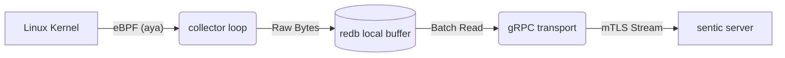

# sentic agent


**The Invisible Observer for Critical Infrastructure.**

**sentic agent** is a high-performance, strictly typed telemetry collector designed for the **sentic observability platform**. Built entirely in Rust, it leverages **eBPF (Extended Berkeley Packet Filter)** to map service topologies and capture golden signals directly from the Linux kernel—without requiring application instrumentation or sidecars.

Designed for banking and high-compliance environments, the agent follows a **"Store-and-Forward"** architecture. It treats data integrity as a first-class citizen, ensuring that no log or trace is lost, even during network failures or power outages.

## 🚀 Key Features

* **Zero-Overhead Tracing:** Uses `aya` to hook into kernel tracepoints (`kprobes`/`uprobes`), capturing TCP flows, process lifecycles, and HTTP latency with negligible CPU impact.
* **Crash-Safe Buffering:** Implements a durable Write-Ahead Log (WAL) using **Redb**. Data is persisted to disk atomically before transmission, guaranteeing **At-Least-Once** delivery.
* **Bank-Grade Security:** Enforces **Mutual TLS (mTLS)** for all communications. The agent cannot talk to the Brain without a valid certificate, and the Brain cannot command the Agent without one.
* **Resource Efficient:** Single static binary (< 15MB). Capped memory usage. No Garbage Collection pauses.
* **Universal Compatibility:** Runs on bare metal, VMs, or inside Containers. Supports legacy kernels (via fallback) and modern kernels (via CO-RE).

## 🏗️ Architecture

The agent operates as a **"Dumb, Durable Courier."** It does not parse or filter data at the edge; it captures raw events, seals them in a durable envelope, and ships them to the **sentic brain** for AI-driven analysis.



### 📦 Component Breakdown

* **crates/sentic-agent**
  * **What:** The main user-space daemon (The Memory & Voice).
  * **Why:** Handles durable persistence (redb), network transmission (gRPC/mTLS), and manages the lifecycle of eBPF programs. Isolated from kernel-space logic for stability.

* **crates/sentic-ebpf**
  * **What:** The kernel-space probes (The Eye).
  * **Why:** Written using Aya, these run inside the Linux kernel. Requires a separate crate due to the `bpfel-unknown-none` target and nightly toolchain.

* **crates/sentic-common**
  * **What:** Shared data structures and constants.
  * **Why:** Used by BOTH agent and eBPF probes. Ensures kernel and user space agree on event memory layout.

* **crates/xtask**
  * **What:** Custom build automation and developer tooling.
  * **Why:** Standardizes eBPF compilation and embedding (e.g., `cargo xtask build`).
## 🛠️ Quick Start

**Prerequisites**

* Linux Kernel 5.4+ (Recommended for eBPF features)

* SystemD

* bpftool (Required for debugging and inspection)

## Installation (Community Edition)

```bash
You can install the agent directly from our public repository:

```bash
# 1. Download and run the install script
curl -sfL [https://raw.githubusercontent.com/kevalabs/sentic-agent/main/install.sh](https://raw.githubusercontent.com/kevalabs/sentic-agent/main/install.sh) | sudo bash

# 2. Configure the upstream Brain
sudo sentic-agent config --server "https://your-sentic-server:8080"

# 3. Start the service
sudo systemctl start sentic-agent

```
## 🤝 Contributing

**sentic agent** is open source (Apache 2.0). We welcome contributions from the community, especially in eBPF probe development.

Please read CONTRIBUTING.md for build instructions and our SECURITY.md for vulnerability reporting.

<p align="center"> Built with ❤️ by <a href="https://kevalabs.com">kevalabs</a> • ideate.build.evolve() </p>
