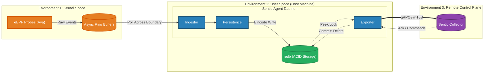

# System Overview

The **sentic agent** is a high-performance, crash-safe observability agent designed for mission-critical Linux infrastructure. 
Unlike traditional agents that rely on reactive `user-space` polling, Sentic leverages `eBPF` to achieve deep, event-driven kernel introspection with minimal overhead.

## 1. High-Level Architecture
The system is logically partitioned into three distinct execution environments to ensure security boundaries and performance isolation.

## 2. Core Architectural Pillars
The design of sentic-agent is governed by immutable principles derived from distributed systems theory and agentic security.

### I. The Principle of Kernel-Centric Truth
Traditional monitoring via `/proc` or `/sys` is susceptible to race conditions and tampering. sentic-agent intercepts events at the point of execution within the kernel.

- **Event-Driven**: By attaching to stable tracepoints (e.g., `sched_process_exec`) and `Kprobes`, we capture short-lived processes and network spikes that escape polling intervals.

- **Immutable Observation**: Utilizing the kernel as the single source of truth ensures that even transient or adversarial behavior is captured as it happens.

### II. The Principle of Durable Autonomy

  In modern data centers, network connectivity can be ephemeral. sentic-Agent is architected to function correctly in isolation.

- **Store-and-Forward**: A "Durable Courier" model decouples the Sensing loop from the Transmission loop.

- **ACID-Compliant Buffering**: Every event is committed to a local **redb** instance—a pure-Rust, Copy-on-Write (CoW) database. This guarantees data durability even during power failures or system crashes.

### III. The Principle of Identity-Based Trust

Operating under a Zero Trust model, sentic-agent assumes the local network may be hostile.

- **Mutual TLS (mTLS)**: Cryptographic identity is enforced for all communication, ensuring only authorized agents can transmit telemetry and only authorized collectors can issue commands.

**Certificate Pinning**: The agent strictly validates server certificates against a private Root CA, eliminating risks of Man-in-the-Middle (MITM) attacks within the data center
